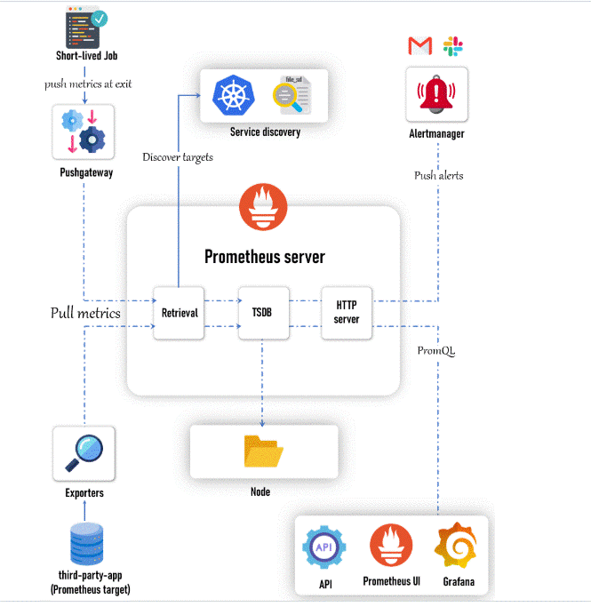

# Introduction to Kubernetes 

## hello

- **#kubectl get node** :  to get node 


```bash
dshdjshdsd
dsjdhjsdjs

```

<details> 
<summary>nodeselctor</summary>

```yaml
apiVersion: v1
kind: Pod
metadata:
  name: nginx
spec:
  containers:
    - name: nginx
      image: nginx:latest
 ```



